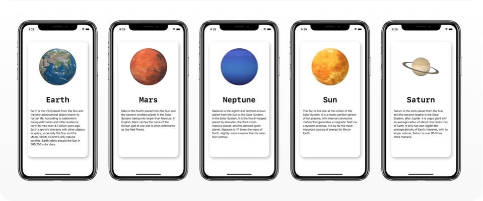

 <p float="left">
       
 </p>
 
 # SceneKit
SceneKit combines a high-performance rendering engine with a descriptive API for import, manipulation, and rendering of 3D assets. SceneKit requires only descriptions of your scene’s contents and the actions or animations you want it to perform. [Know more here](https://developer.apple.com/documentation/scenekit/)

# Preview
 <p float="left">
       
 </p>
 
 # Installation 🛠
- Clone / download this repository.
- change the bundle identifier in project settings.
- run the app.
```
⚠️ Xcode 12.0 or above is required to run this project.
```


# SwiftUI 2.0 + SceneKit
- You can now import both SwiftUI and SceneKit and pass along your scenes, nodes, to a SceneView that can be configured to render your scene inside your hierarchy.

### Example
```Swift
import SwiftUI
import SceneKit

struct ContentView: View {
  var scene = SCNScene(named: "MyScene")
		
  var cameraNode: SCNNode? {
    scene?.rootNode.childNode(withName: "camera", recursively: false)
    }
		
    var body: some View {
    SceneView(
      scene: scene,
      pointOfView: cameraNode,
      options: []
    )
  }
}
```
